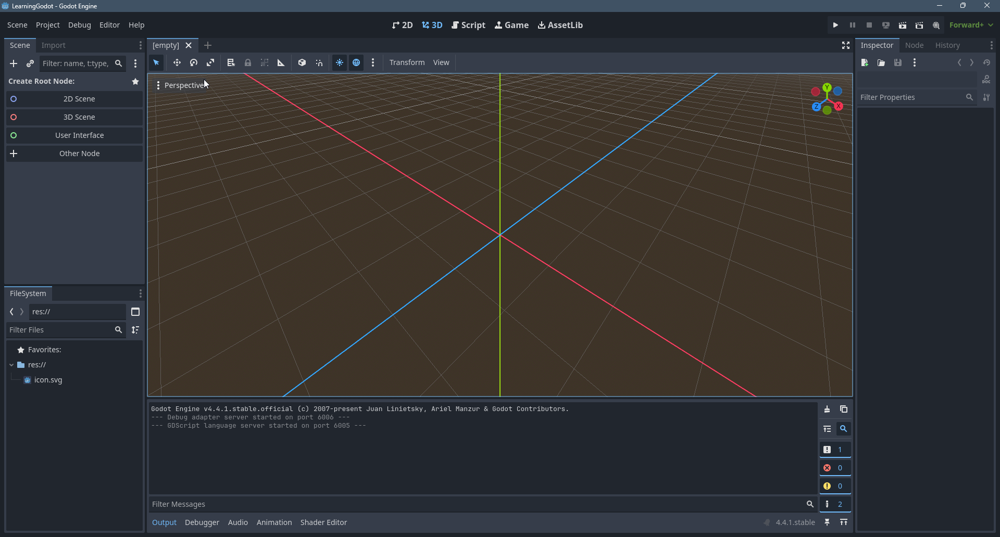
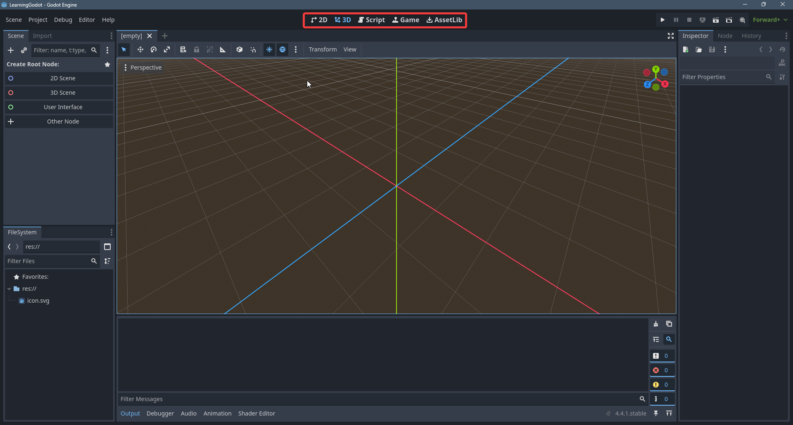
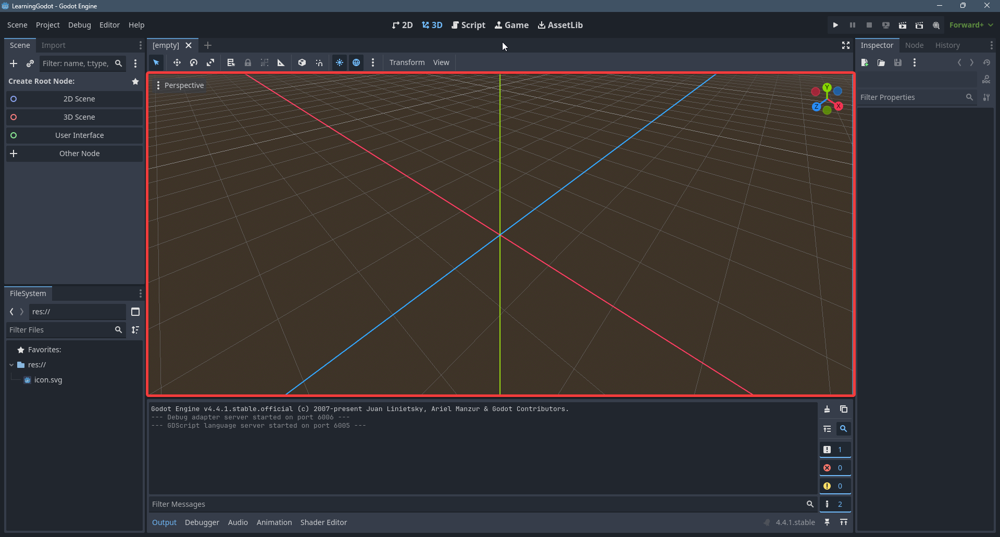
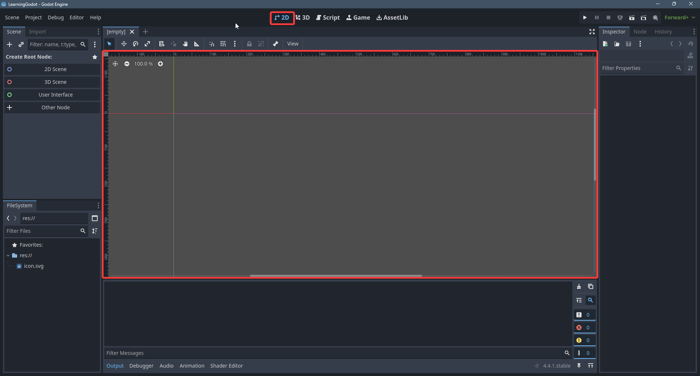
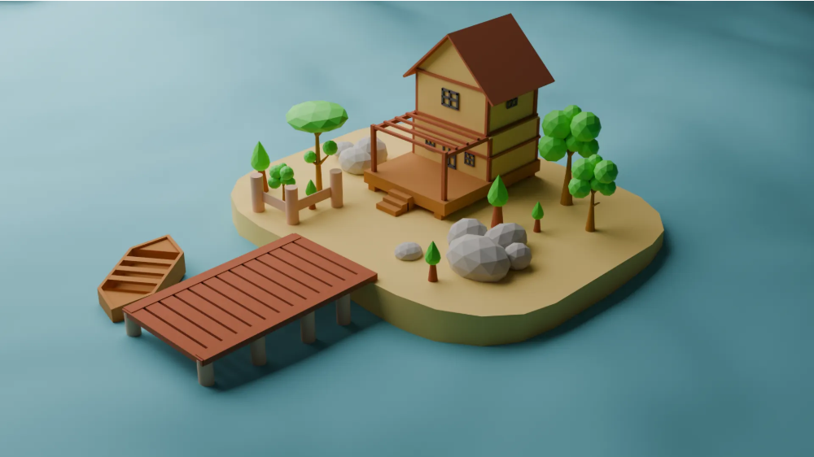
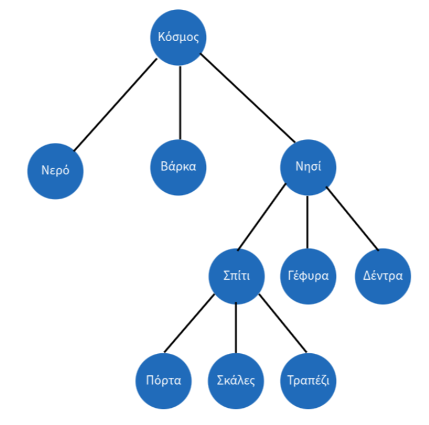
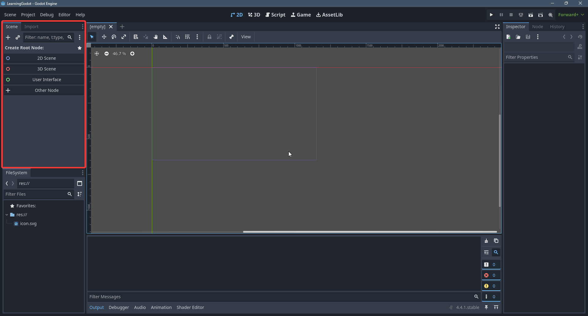
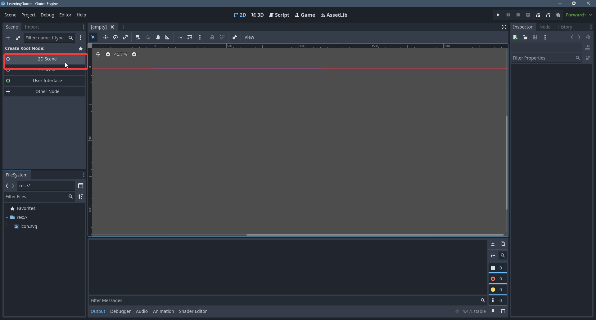
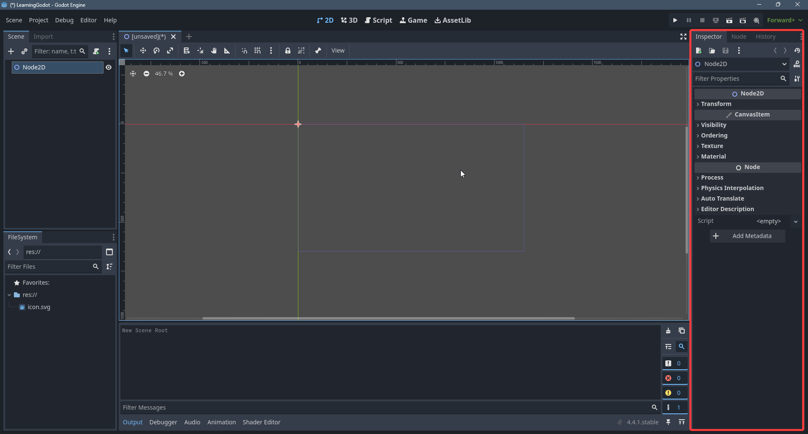
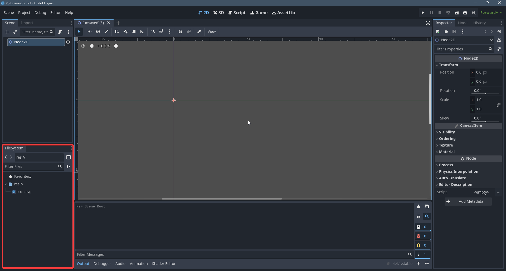

# 1.2 Godot Interface
Αυτό είναι το Godot Editor

Πάνω έχουμε τα διάφορα **Workspaces**.
- 2D 2D view του παιχνιδιού μας
- 3D: 3D view του παιχνιδιού μας
- Script: Το μέρος που θα γράφουμε τον κώδικα
- Game: Το παιχνίδι μας (Πρέπει να πατήσουμε Play πρώτα)
- AssetLib: Δωρεαν εργαλεία και assets

Εδώ είναι το Viewport που θα βλέπουμε το workspace στο όποιο βρισκόμαστε τώρα. Τώρα έχουμε διαλέξει το 3D workspace οπότε βλέπουμε τον κόσμο σε 3D.

Αρχικά θα φτιάχνουμε 2D παιχνίδια οπότε ας ανοίξουμε το 2D workspace
Αν πατήσουμε **τη ροδέλα του ποντικιού** και κουνήσουμε το ποντίκι μπορούμε να κουνήσουμε την κάμερα.
Κουνώντας την **ροδέλα του ποντικιού** πάνω και κάτω μπορούμε να κάνουμε zoom in και zoom out.

Κάθε παιχνίδι αποτελείται απο κάποια **Scenes** (κοινώς γνωστά ως levels). Στο 2D viewport βλέπουμε το Scene που έχουμε τώρα ανοιχτό.

Κάθε Scene αποτελείται απο **Nodes**. Τα **Nodes** είναι τα βασικά κομμάτια ενός παιχνιδιού σε Godot. Κάθε σκηνή έχει ενα **root node**.

Ας δούμε ένα παράδειγμα απο μια σκηνή. Έστω οτι έχουμε τον παρακάτω κόσμο.

Η σκηνή μας θα έχει μια ιεραρχική δομή. Η ρίζα μας (**root node**) θα ονομάζεται *Κόσμος* και θα ιεραρχήσουμε τα **nodes** μας ανάλογα.

To *Νερό*, *Βάρκα*, *Νησί* θα είναι **nodes**

Αριστερά έχουμε το **Scene Tab** που δείχνει την ιεαρχική δομή της τωρινής σκηνής. Τώρα δεν έχουμε κανένα node στην σκηνή μας οπότε η Godot μας προτρέπει να φτιάξουμε ένα.

Εμείς θα φτιάχνουμε αρχικά 2D παιχνίδια οπότε θα βάλουμε ως **root node** ένα **Node2D**

Άμα πατήσουμε πάνω στο **Node2D** που φτιάξαμε μπορούμε να δούμε λεπτομέρειες για αυτό το **node** στο **Ιnspector Τab** δεξία. Μπορούμε να αλλάξουμε την θέση του node, την περιστροφή του ή ακόμα και το μέγεθος του.

Kάτω αριστερά έχουμε το **FileSystem Tab** που έχει όλα τα assets του παιχνιδιού μας (art,ήχους κτλπ). Είναι πολυ παρόμοιο με ένα file system ενός λειτουργικού συστήματος
