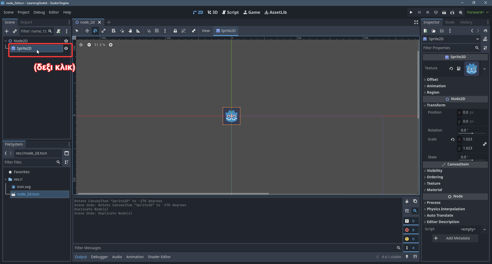

# 1.3 Exploring Nodes
Ας ανοίξουμε το τελευταίο project η ακόμα και ένα νέο. Θα φτιάξουμε μια νέα σκηνή (**scene**). 

Θα είναι μια 2D σκηνή οπότε βάζουμε ως **root** ένα **Node2D**

Ολα τα **nodes** που θα φτιαξουμε θα είναι "παιδιά" του root node του **scene** μας. Ας βάλουμε ενα **Sprite2D**

Ενα **Sprite2D** χρησιμοποιήται για να δείξουμε μια είκονα/sprite στην οθόνη. Αμα διαλέξουμε το Sprite2D node που φτιάχτηκε:

Δεξιά στο **Inspector Tab** η Godot μας δείχνει πληροφορίες για το **Sprite2D**. Στο πεδίο **Texture** μπορούμε να αλλάξουμε την εικόνα που δείχνει το **Sprite2D** μας.

Άμα πατήσουμε click έχουμε πολλές επιλογές για το **Texture**. Εμείς θα βάλουμε το *icon.svg* που μας έδωσε η Godot μόλις δημιουργήσαμε το project μας.

Τώρα στην σκηνή μας έχουμε την εικόνα

Ας δοκιμάσουμε να παίξουμε το παιχνίδι μας

Μόλις πατήσουμε το **Play Button** η Godot θα μας εμφανίσει το μύνημα

Σε κάθε Godot παιχνίδι υπάρχει μια κύρια σκηνή (**Main Scene**). Αυτή την σκηνή την θέτουμε εμείς και είναι η σκηνή που θα ανοίξει η Godot μόλις ξεκινήσουμε το παιχνίδι μας. Η Godot μας δίνει διάφορες επιλογές τώρα. Ας διαλέξουμε να βάλουμε την σκηνή που έχουμε ανοιχτή τώρα να είναι το **Main Scene** μας.

Επίσης δεν έχουμε κάνει κάπου save την σκηνή μας, οπότε η Godot μας προτρέπει να το κάνουμε.

Μολίς το κάνουμε αυτό θα ανοιξει το παιχνίδι μας

Παρατηρούμε οτι η εικόνα που βάλαμε δεν είναι καν μέσα στην οθονή. Πάμε να δούμε γιατί

Αυτην την στιγμή δεν έχουμε κάποια κάμερα στη σκηνή μας οπότε ότι δείχνουμε στην οθόνη θα βρίσκεται μέσα σε ένα ορθογωνίο που ορίζει η Godot. Αυτο το Godot είναι χρωματισμένο με μωβ

Αυτο το ορθογωνίο ξεκινάει απο το (0,0) και έχει ένα πλάτος και ένα ύψος. Αυτα τα ορίζει η Godot. Μπορούμε να τα αλλάξουμε στα **Project Settings**.

Αλλά ας το αφήσουμε έτσι όπως είναι

Κάθε **Node2D** έχει ενα **Transform**. Αυτό το **Transform** αποτελείται απο:
- Position (Θέση). Που είναι η 2D συντεταγμένες του αντικείμενου
- Rotation (Περιστροφή). Που είναι οι μοίρες που είναι γυρισμένο το αντικείμενο
- Scale (Μέγεθος). Που είναι το μέγεθος του αντικειμένου στους άξονες x και y

Μπορούμε να δούμε το **Transform** κάθε αντικειμένου στο **Inspector Tab**.

Εδώ είναι σημαντικό να ξεκαθαρίσουμε οτι η θέση ορίζεται με την βοήθεια του καρτεσιανού συστήματος. Το κέντρο του κόσμου είναι το (0,0). Όσο αυξάνει το x πάμε δεξιά όσο μειώνεται πάμε αριστερά. Όσο αυξάνει το y πάμε πάνω όσο μειώνεται πάμε κάτω.

Δοκιμάστε να πειράξετε λίγο τις τιμές για να δείτε πως θα αλλάξει η εικόνα μας

Εγώ για παράδειγμα έβαλα αυτές τις τιμές

Παρόλλα αυτά δεν είναι τοσο πρακτικό να κουνάμε τα αντικείμενα με νούμερα.

Για αυτό η Godot μας δείνει διάφορα εργαλεία στο **Toolbar**

Τώρα έχουμε διαλέγμενο το **Select Mode**. Αυτό μας επιτρέπει να πάτησουμε κλικ πάνω σε αντικείμενα και να τα κουνήσουμε κρατόντας το δεξί κλικ. Μπορούμε επίσης να χρησιμοποιήσουμε τις κόκκινες τελίτσες για να αλλάξουμε το μέγεθος του.

Μετά έχουμε το **Move Mode** που είναι μόνο για να κουνάμε το αντικείμενο στον x, στον y ή και στους δύο.

Μετά έχουμε το **Rotate Mode** που είναι για να περιστρέψουμε το αντικείμενο

Τέλος έχουμε το **Scale Mode** για να αλλάζουμε το μέγεθος του αντικειμένου

Για αυτά τα modes υπάρχουν και κάποια shortcuts
- Q = **Selection Mode**
- W = **Move Mode**
- E = **Rotate Mode**
- S = **Scale Mode**

Επίσης μπόρουμε να κάνουμε duplicate ένα Node.

Το shortcut είναι Ctrl+D

Με όλα αυτά μου μάθαμε προσπαθήστε να φτιάξετε ένα σχέδιο που εμφανίζεται όταν πατάτε **Play**

Να τι έφτιαξα εγώ
