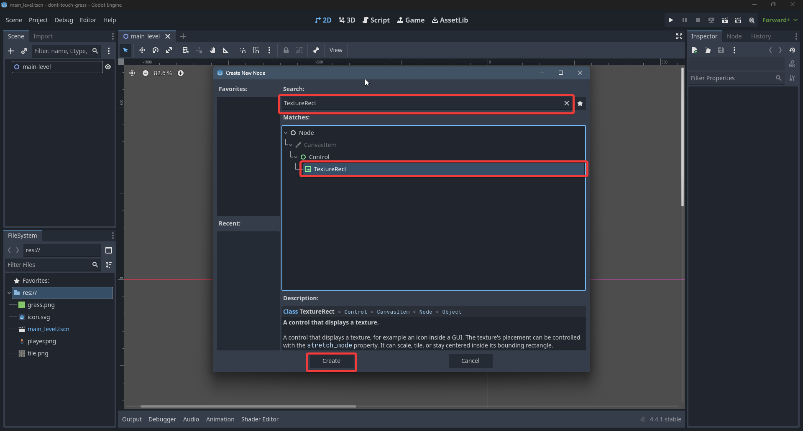
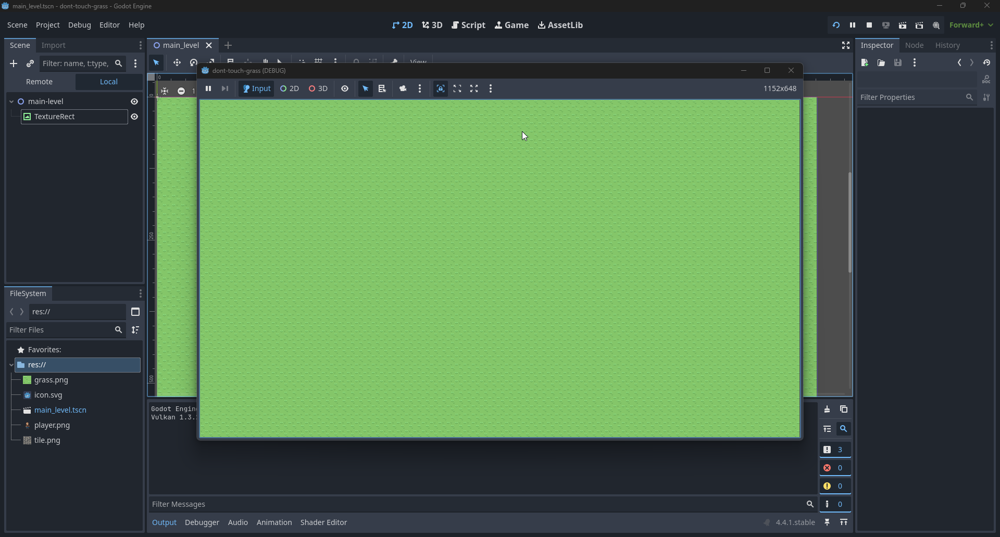

# Creation

## Description
Σε αυτο το project θα φτιάξουμε έναν παίχτη που πρέπει να φτάσει απο την αρχή ενός level στο τέλος χωρίς να αγγίξει το γρασίδι!

## Start
Ας φτιάξουμε ένα νέο project.

Το παιχνίδι θα είναι 2D οπότε ας πάμε στο 2D workspace

Ας φτιάξουμε ένα root **Node2D**

Θα το ονόμασουμε *main-level* γιατί θα είναι το root node της κυρίας σκηνής μας (**main scene**). Το όνομα είναι για εμάς. Δεν παίζει κάποιο ρόλο.

Κάνουμε save (Ctrl+S) την σκήνη μας οπώς στο προηγούμενο κεφάλαιο. Ονομάστε το *main_level.tscn*

Τώρα θέλω το main_level να είναι όντως το scene που θα ανοιξεί η Godot μόλις ανοιξεί το παιχνίδι. Είδαμε έναν έμεσο τρόπο πως να το κάνουμε στο προηγούμενο κεφαλαίο. Τώρα ας το κάνουμε απο τα **Project Settings**

## 2D Assets

Στο game θα μας χρειάστουμε κάποια 2D assets. Δηλαδή κάποιες εικόνες που θα αναπαριστούν το γρασιδί, τον παίχτη, το πάτωμα κτλπ. Ολά αυτά μπορείτε να τα φτιάξετε μόνοι σας σε κάποιο 2D πρόγραμμα, αλλά τώρα μπορείτε να πάρετε τα έτοιμα που βρισκόνται στο path ./assets. Οπότε κατεβάστε τα ένα ένα και κάντε drag drop εδώ

Τώρα θα βάλουμε ένα νέο node στο scene μας. Ονομάζεται **TextureRect** και είναι ένα node για να δείχνουμε μια εικόνα. Είναι παρομοιό με το **Sprite2D**, αλλά με λιγό διαφορετική συμπεριφορά

Τώρα έχοντας διαλέξει το **TextureRect** θα του βάλουμε να έχει texture το *grass.png*

Βάλτε το να καλύπτει όλη την οθόνη. Θυμίζω οτι η οθονή φένεται απο το μωβ ορθογώνιο

Παρόλλα αυτα βλέπουμε οτι είναι λίγο χάλια. Αυτο γίνεται γιατι η εικόνα μας έχε μεγεθος 16x16 pixels και την κάνουμε πολυ μεγαλύτερη. Αυτο που θα κάνουμε τώρα είναι αντι το texture να κανει "stretch" να επαναλαμβάνεται συνέχεια

Τώρα άμα παίξουμε το αποτέλεσμα είναι λιγο καλύτερο
