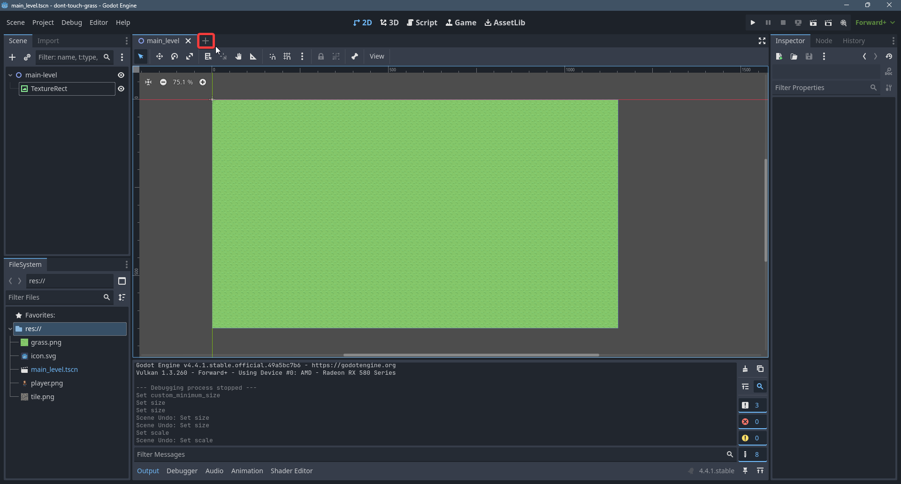
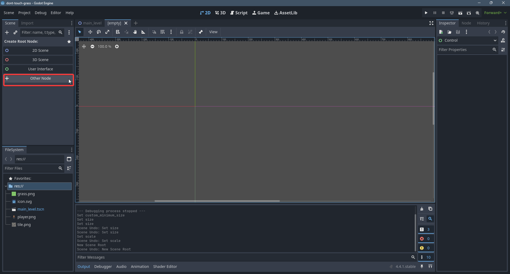
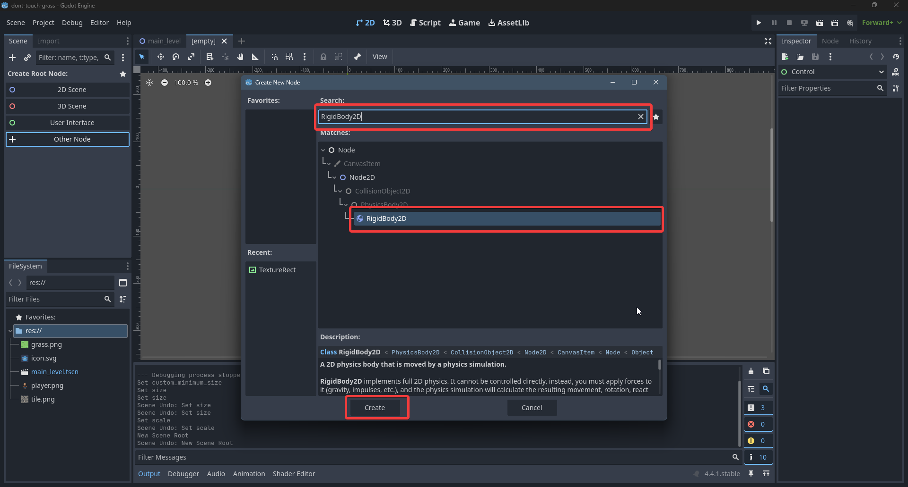

# Player

Τώρα θα φτιάξουμε τον παίχτη μας. Ο παιχτής ουσιαστικά θα είναι μια σκηνή απο μόνος του. Γιατι? Γιατι άμα έχουμε πολλες σκηνες (levels) μπορούμε να βάλουμε αυτον τον παίχτη σε πολλές σκηνες. Έστω μια αλλαγή του παίχτη στην σκηνή του θα οδηγήσει και σε αλλαγή του παίχτη σε όλα τα levels (πχ αμα αλλάξουμε το χρωμα του)

## Physics Engine
Σε κάθε game engine συνήθως υπάρχει ένα physics engine το οποιο χρησιμοποιηται για να προσωμοιοσουμε τις φυσικές ιδιότητες της πραγματικότητας. Τα κύρια συστατικά της προσωμοιωσης αυτής είναι τα **Rigidbodies**. Άμα θέλουμε ένα αντικείμενο μας να συμμετέχει σε αυτην την προσωμοιωση του βάζουμε ενα rigidbody node. Ο παίχτης μας θέλουμε να έχει physics οπότε θα του βάλουμε ως **root node** ένα **RigidBody2D**.

Κάντε save την σκηνή (Ctrl+S) και ονομάστε την *player.tscn*