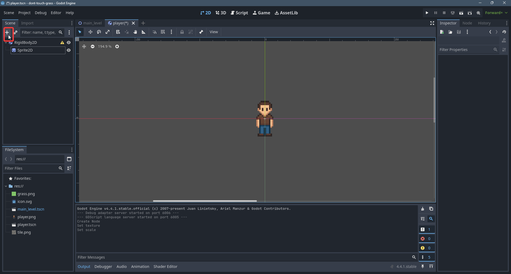

# Player

Τώρα θα φτιάξουμε τον παίχτη μας. Ο παιχτής ουσιαστικά θα είναι μια σκηνή απο μόνος του. Γιατι? Γιατι άμα έχουμε πολλες σκηνες (levels) μπορούμε να βάλουμε αυτον τον παίχτη σε πολλές σκηνες. Έστω μια αλλαγή του παίχτη στην σκηνή του θα οδηγήσει και σε αλλαγή του παίχτη σε όλα τα levels (πχ αμα αλλάξουμε το χρωμα του)

## Physics Engine
Σε κάθε game engine συνήθως υπάρχει ένα physics engine το οποιο χρησιμοποιηται για να προσωμοιοσουμε τις φυσικές ιδιότητες της πραγματικότητας. Τα κύρια συστατικά της προσωμοιωσης αυτής είναι τα **Rigidbodies**. Άμα θέλουμε ένα αντικείμενο μας να συμμετέχει σε αυτην την προσωμοιωση του βάζουμε ενα rigidbody node. Ο παίχτης μας θέλουμε να έχει physics οπότε θα του βάλουμε ως **root node** ένα **RigidBody2D**.

Κάντε save την σκηνή (Ctrl+S) και ονομάστε την *player.tscn*

Τώρα ας βάλουμε ένα **Sprite2D** για τον παίχτη μας

Και θέτουμε ως texture το *player.png* που πήραμε απο τον assets φάκελο

Η εικόνα αυτην την στιγμή είναι σχετικά μεγαλή. Οπότε θα μικρύνουμε λίγο το **scale** της

Μια καλή τιμή που έχω δοκιμάσει είναι 0.08 και στους δυο αξόνες του **scale**

Αμα παρατηρήσετε υπάρχει ένα warning στο **RigidBody2D**

Αυτην την στιγμή το **rigidbody** μας δεν έχει κάποιο σχήμα. Απλα το έχουμε πει οτι θέλουμε να έχει physics. Αλλά δεν του έχουμε δώσει ένα σχήμα για να κάνει collide με αλλα **rigidbodies**. Αυτο μπορούμε να το κάνουμε με ένα **CollisionShape2D**

Τώρα έχουμε ένα τετράγωνο όπου θα χρησιμοποιήται για τα collisions με το περιβάλλον. Ας το κάνουμε να καλύπτει πλήρως τον παίχτη, ετσί ώστε τα collisions να αντιστοιχούν με το sprite του παιχτη.

Τώρα θα βάλουμε τον παίχτη μας στο *main_level* μας

