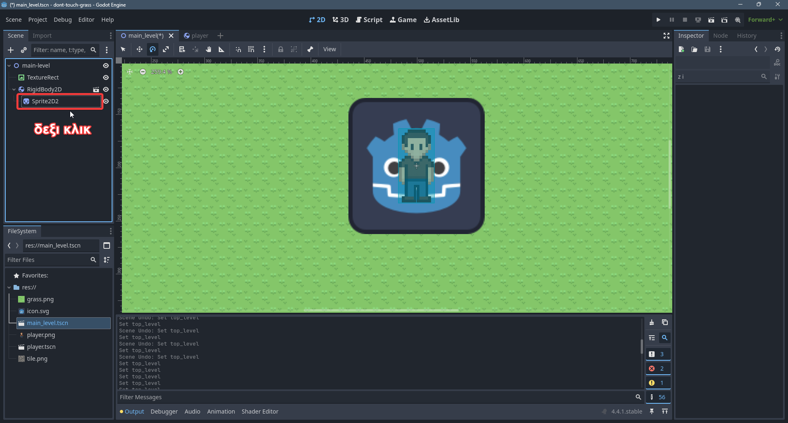

# Parents

## Δένδρα Slang
Τα δένδρα στην επιστημή υπολογιστών είναι μια δομή δεδομένων που είναι σαν ένα ανάποδο δέντρο. Οπου πάνω πάνω έχουν την ριζα

Οι μπλέ κύκλοι ονομάζονται **κόμβοι** και οι γραμμές που τους συνδέουν **ακμές**.

Ένας τρόπος να οργανώσουμε τους κόμβους είναι με βάση το βάθος/επίπεδο τους στο δέντρο. Ο κόσμος βρίσκεται στο επίπεδο 0, το Νερό στο επίπεδο 1 κτλπ.

Έστω δύο κόμβοι. Ένας κόμβος a στο επίπεδο n και ένας άλλος b στο n-1. Τότε λέμε οτι ο κόμβος b είναι ο γονέας του a και ότι ο κόμβος a είναι παιδί του b.

Οπως ειπάμε και άλλη φορά μια σκηνή στην Godot έχει ιεραρχική δενρική δομή. Η δενδρική αυτή δομή φένεται στο **Scene Tab**

Προς το παρόν όλες οι σκηνές μας έχουν ένα root node και όλα τα άλλα nodes είναι παιδιά του. Η δομή του *main_level.tscn* είναι:

Ας βάλουμε ενα **Sprite2D** να είναι παιδί του RigidBody2D (του παίχτη δηλαδη)

Σε αυτό το σημείο λογικά μπορείτε να βάλετε ενα **SpriteNode2D** ώς παιδί του **RigidBody2D** με texture το *icon.svg*, καθώς το έχουμε αναφέρει σε προηγούμενα κεφάλαια.

Μόλις τα κάνετε όλα αυτά πρέπει να βλέπετε κάτι τέτοιο

Διαλέξτε το **Sprite2D** που βάλαμε και κουνήστε το λίγο να μην καλύπτει τον παίχτη

Αυτην την στιγμή το **Sprite2D** είναι παιδί του  **RigidBody2D** (παίχτης). Ένας γονέας αμα κουνηθεί παίρνει μαζι του και τα παιδία του. Δοκιμάστε να κουνισεται, περιστρέψεται, αλλαξετε το μεγεθος του παιχτη

Ας πάμε να δούμε λιγο το **Transform** του **Sprite2D**.

Το **Trasnform** ενός παιδιού είναι πάντα σε σχέση με τον γονέα του. Δηλαδή εδω το **Sprite2D** είναι μετατοπισμένο κατα -153 στον X και -11 στον Y **σε σχεση με τον γόνεα**. Βλέπουμε οτι το rotation σε σχεση με τον γονέα είναι 0 ακόμα και αν ο γονέας έχει κάποιο rotation.

Σε περίπτωση που θέλουμε ένα παιδί το **Transform** του να μην είναι σε σχέση με τον γονέα του μπορούμε να χρησιμοποιούμε το *Top Level*. Αυτο έχει ως αποτέλεσμα, το **Transform** να είναι σε σχέση με το κέντρο του κόσμο μας (0,0) και όχι σε σχέση με τον παίχτη

Ας κλείσουμε το *Top Level*. Ας βάλουμε το **Sprite2D**  να έχει σχετική απόσταση (0,0) και ας θέσουμε την περιστροφή του γονέα (παίχτη) να είναι 0. Δηλαδή θα βλέπουμε πάλι κάτι τέτοιο.

Αυτην την στιγμή θέλω να μπορώ να ζωγραφίσω τον παίχτη μπροστά απο το εικονίδιο της Godot. Αυτο μπορούμε να το επιτύχουμε με το **Ζ Index**. Κάθε **Sprite2D** έχει ενα Z Index. Η Godot θα ζωγραφίσει μπροστά το sprite με το μεγαλύτερο Z Index. Αυτην την στιγμη και τα δυο sprite έχουν Z Index = 0, άρα η Godot ζωγραφίζει όποιο είναι πιο κάτω στο **Scene Tab**. Εκτός απο το **Transform** και το Z index είναι σχετικό και με βάση τον γονέα. Παρόλλα αυτά υπάρχει και εδώ επιλογή να το βάλουμε να μην είναι relative.

Οπότε άμα βάλουμε τον παίχτη να έχει Z Index = 1. Θα ζωγραφιστεί μπροστά απο το εικονίδιο.

Κλείνοντας σβήστε το **Sprite2D**. Δεν θα μας χρειαστεί μετά.

