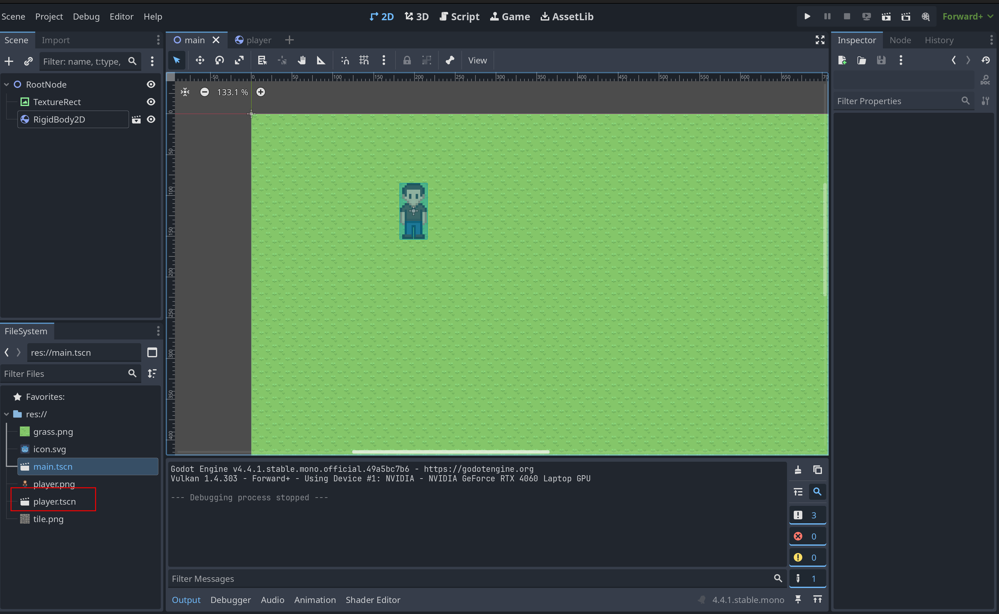
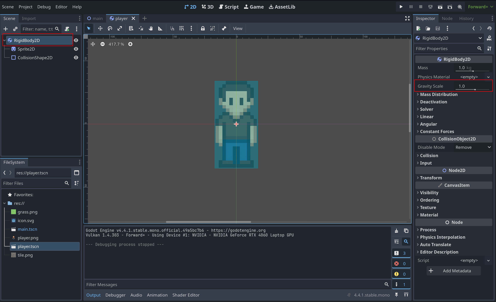
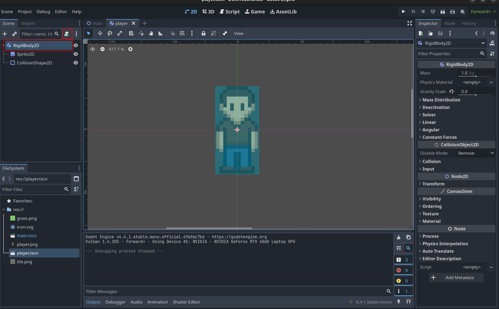
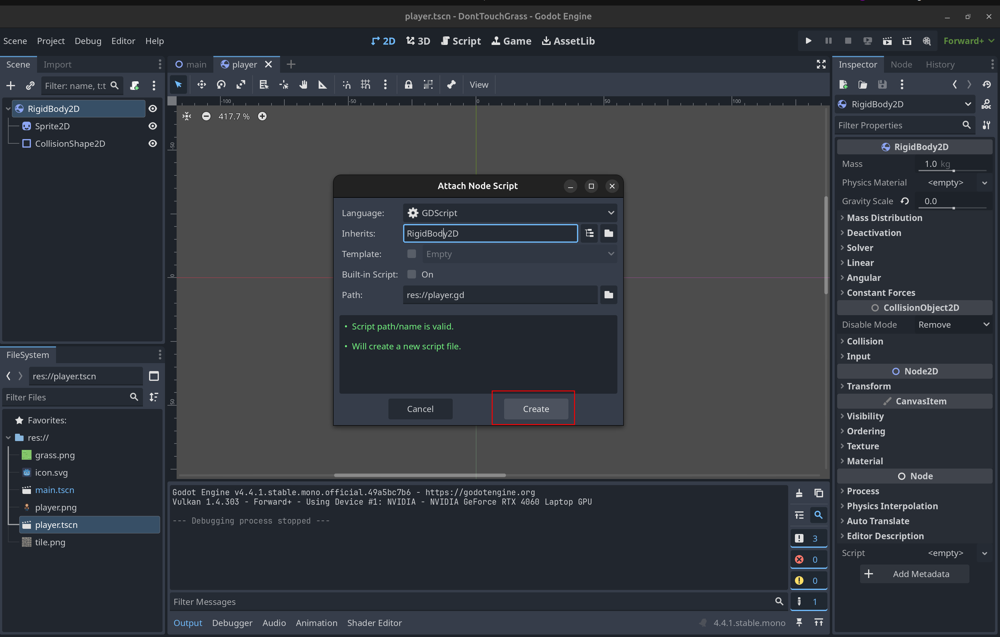
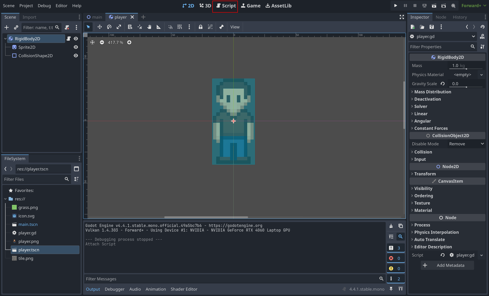
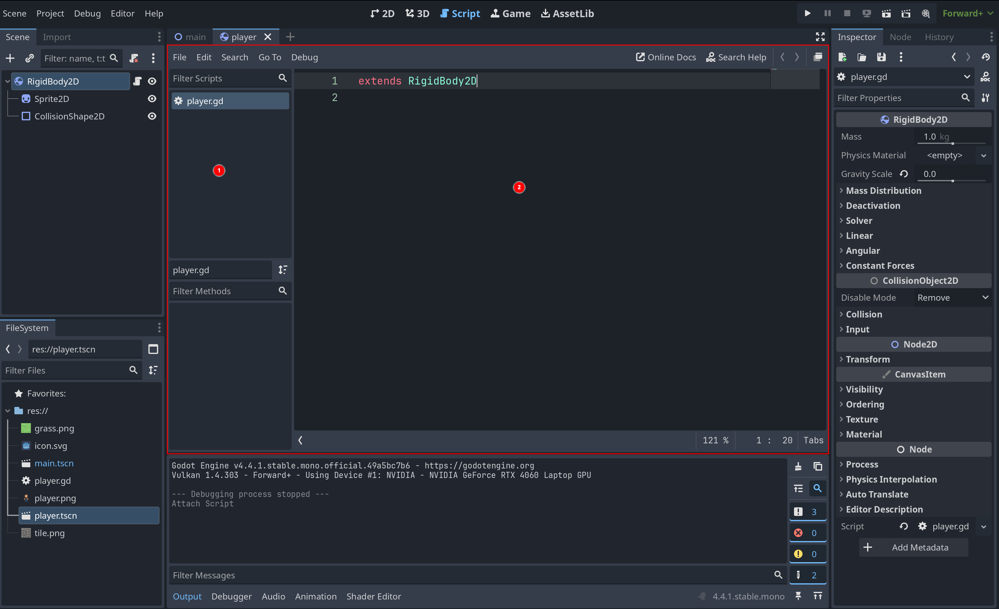

# 2.4 Scripting

## Βαρύτητα

Αυτην την στιγμή άμα παίξουμε το παιχνίδι μας ο παίχτης θα αρχίσει να πέφτει προς τα κάτω. Αυτο γιατί τον έχουμε βάλει να είναι **Rigidbody2D** και ετσι να συμμετέχει στην προσομοίωση φυσικής του παιχνιδιού μας. Ολα τα **Rigidbody2D** έχουν βαρύτητα την οποία μπορούμε να κλείσουμε. Ας ανοίξουμε την σκηνή του παίχτη

Βάλτε την βαρύτητα στο **Rigidbody2D** να είναι 0

Τώρα άμα παίξετε την main σκηνή ο παίχτης δεν πέφτει

## Scripting
Τώρα θα κάνουμε τον παίχτη μας να μπορεί να κουνηθεί. Αυτο θα το κάνουμε φτιάχνοντας ένα script. Ενα script είναι ένα αρχείο που έχει μέσα κάποιο κώδικα τον οποίο θα γράψουμε στην ειδική γλώσσα προγραμματισμού της Godot. Την GDScript. Συνήθως αντιστοιχούμε κάθε script σε ένα Node. Οπότε ας φτιάξουμε ένα script που θα είναι "πάνω" στο RigidBody2D node του παίχτη μας.



Τώρα αμα δεν σας έχει ανοίξει αυτόματα. Πάμε στο **Scripting Workspace** για να δούμε το script που φτιάξαμε

Αριστερά στο (1) βλέπουμε όλα τα script που έχουμε στο project μας. Και στη (2) μέση το script που έχουμε διαλεγμένο και τον κώδικα του. (Αμα δεν βλέπετε κάτι στην μέση πατήστε το player.gd)


### Function
Ένα function είναι ένα κομμάτι κώδικα που μπορούμε να καλέσουμε απλα με το όνομα του. Συντακτικό
```python
func function_name(function_parameters) -> return_type:
    # code
```

### Begin
Ας γράψουμε το πρώτο μας script. Αυτην την στιγμή θέλω το script μου μόλις ξεκινάει το παιχνίδι να εκτυπώνει ένα μύνημα στην κονσόλα. Αρα θέλω να εκτελέσω μια εντολή μόλις ξεκινήσει το παιχνίδι. Αλλά πως θα ξέρω στο script μου πότε έχει ξεκινήσει το παιχνίδι? Για αυτο τον λόγο κάθε node "έχει μέσα του" μια function που την καλεί αυτόματα η Godot μόλις ξεκινήσει το παιχνίδι. Αυτη η function