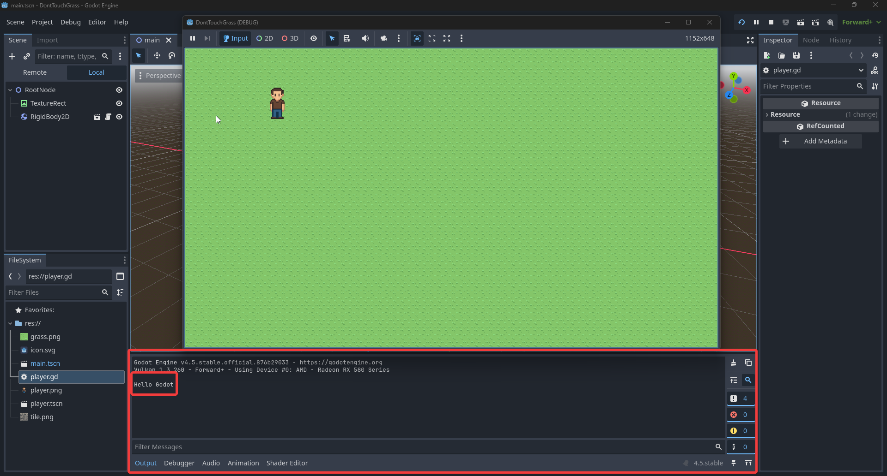
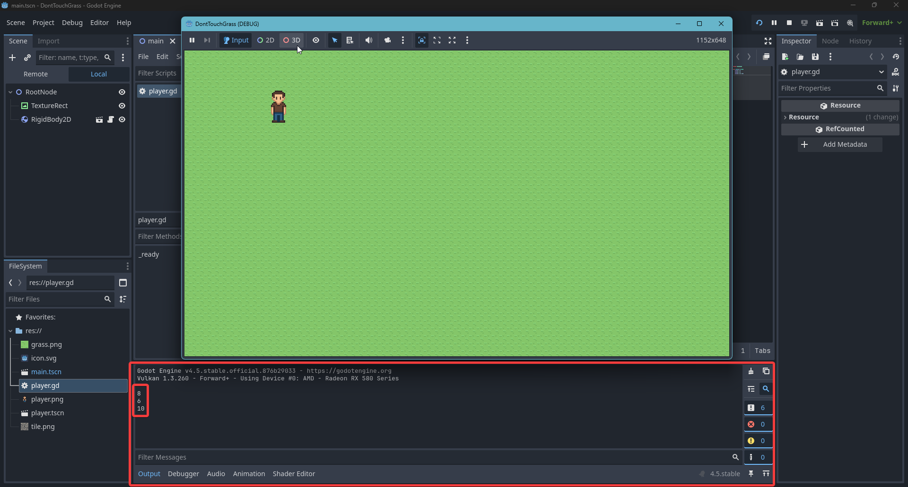

# 2.4 Scripting

## Βαρύτητα

Αυτην την στιγμή άμα παίξουμε το παιχνίδι μας ο παίχτης θα αρχίσει να πέφτει προς τα κάτω. Αυτο γιατί τον έχουμε βάλει να είναι **Rigidbody2D** και ετσι να συμμετέχει στην προσομοίωση φυσικής του παιχνιδιού μας. Ολα τα **Rigidbody2D** έχουν βαρύτητα την οποία μπορούμε να κλείσουμε. Ας ανοίξουμε την σκηνή του παίχτη

Βάλτε την βαρύτητα στο **Rigidbody2D** να είναι 0

Τώρα άμα παίξετε την main σκηνή ο παίχτης δεν πέφτει

## Scripting
Τώρα θα κάνουμε τον παίχτη μας να μπορεί να κουνηθεί. Αυτο θα το κάνουμε φτιάχνοντας ένα script. Ενα script είναι ένα αρχείο που έχει μέσα κάποιο κώδικα τον οποίο θα γράψουμε στην ειδική γλώσσα προγραμματισμού της Godot. Την GDScript. Συνήθως αντιστοιχούμε κάθε script σε ένα Node. Οπότε ας φτιάξουμε ένα script που θα είναι "πάνω" στο RigidBody2D node του παίχτη μας.


Τώρα αμα δεν σας έχει ανοίξει αυτόματα. Πάμε στο **Scripting Workspace** για να δούμε το script που φτιάξαμε

Αριστερά στο (1) βλέπουμε όλα τα script που έχουμε στο project μας. Και στη (2) μέση το script που έχουμε διαλεγμένο και τον κώδικα του. (Αμα δεν βλέπετε κάτι στην μέση πατήστε το player.gd)


### Τύποι Δεδομένων
Στις γλώσσες προγραμμτισμού οι τιμές μας ανήκουν (σχεδόν) πάντα σε ένα τύπο δεδομένων. Οι πιο κοινόι τύποι δεδομένων στην GDScript είναι:

- ```bool``` = τιμη ```true``` ή `false` (αληθές ή ψευδές)
- ```int``` = ακεραιος αριθμος (...,-2,-1,0,1,2,...)
- ```float``` = δεκαδικος αριθμος (πχ 3.14,1.5,-2.52)
- ```string``` = συμβολοσειρά (πχ "hello", "bye")

### Function
Ένα function είναι ένα κομμάτι κώδικα που μπορούμε να καλέσουμε απλα με το όνομα του. Για να ορίσουμε ένα function γράφουμε:
```python
func function_name(function_parameters) -> return_type:
    # code
```
το ```function_name``` είναι όνομα που επιλέγουμε να δώσουμε στην συνάρτηση
τα ```function_parameters``` είναι κάποιες παράμετροι που μπορούμε να περάσουμε σε μια συνάρτηση (function)
το ```return_type``` είναι ο τύπος δεδομένων της τιμής που θα επιστρέψουμε

Για παράδειγμα αμα θέλαμε να φτιάξουμε μια συναρτήση που να προσομοιώνει την λειτουργία της μαθηματικής συνάρτησης f(x) = 2x + 2, θα την ορίζαμε ως:
```python
func f(x) -> float:
    return 2 * x + 2
```

### Begin
Ας γράψουμε το πρώτο μας script. Αυτην την στιγμή θέλω το script μου μόλις ξεκινάει το παιχνίδι να εκτυπώνει ένα μύνημα στην κονσόλα. Αρα θέλω να εκτελέσω μια εντολή μόλις ξεκινήσει το παιχνίδι. Αλλά πως θα ξέρω στο script μου πότε έχει ξεκινήσει το παιχνίδι? Για αυτο τον λόγο κάθε node "έχει μέσα του" μια function που την καλεί αυτόματα η Godot μόλις ξεκινήσει το παιχνίδι. Αυτη η function ονομάζεται _ready

```python
func _ready() -> void:
```

Το void σημαίνει οτι η συνάρτηση δεν επιστρέφει καμία τιμή.
Αμα γράψετε το παραπάνω στο script μας η Godot θα σας γράψει ένα error. Αυτο συμβαίνει γιατί όλες οι συναρτήσεις (function) στην GDScript πρέπει να έχουν τουλάχιστον μία γραμμή κώδικα μέσα τους. Άμα δεν θέλετε να βάλετε κάτι προς το παρόν μπορείτε να χρησιμοποιήσετε το keyword **pass**, το οποίο δεν κάνει τίποτα.

```python
func _ready() -> void:
    pass
```

Στον παραπάνω κώδικα μπορείτε να παρατηρήσετε ότι το **pass** που είναι μέσα στην function έχει ένα κενό πριν. Αυτο το κενό το βάζουμε με το κουμπί **TAB** και δείχνει στην GDScript οτι το pass είναι μέσα στην function μας.

Τώρα θέλω να τυπώσω ένα μύνημα στην κονσόλα μου στην αρχή του παιχνιδιού. Αυτο μπορούμε να το κάνουμε με την συνάρτηση ```print()```

```python
func _ready() -> void:
    print("Hello Godot")
```

Η print γενικά δέχεται ως παράμετρους αρκετούς τύπους δεδομένων. Εμείς σε αυτην την περίπτωση της περνάμε ένα string (συμβολοσειρά = σειρά απο σύμβολα/γράμματα). Θα παρατηρήσετε οτι την συμβολοσειρά που περνάμε την βάζουμε ανάμεσα στα σύμβολα ```""``` . Αυτο το κάνουμε για να δείξουμε οτι τα γράμματα που γράφουμε μέσα στα ```""``` δεν είναι κώδικας και είναι απλά κείμενο. Τώρα άμα πατήσουμε play, τυπώνεται το μύνημα μας


Στις γλώσσες προγραμματισμού οι αριθμητικές πράξεις είναι πολύ σημαντικές, οπότε προφανώς υπάρχουν και στην GDScript. Παρακάτω θα υπολογίσουμε κάποια αποτελέσματα και τα εκτυπώσουμε κατευθείαν.

```python
func _ready() -> void:
    print(3 + 5)
    print(2 * 3)
    print(2 * (3 + 2))
```
