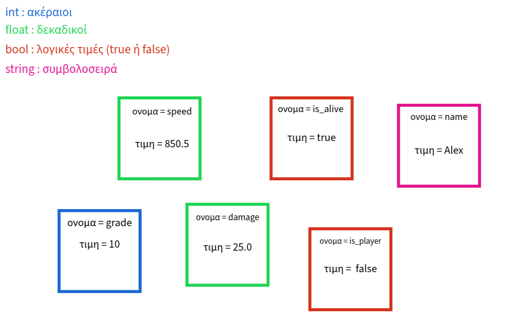

# 2.5 Scripting 2

## Μεταβλητές

Ας επιστρέψουμε στο script απο την προηγούμενη φορά. Στις γλώσσες προγραμμτισμού χρησιμοποιούμε μεταβλητές. Οι μεταβλητές χρησιμοποιούνται για να αποθηκεύουμε τιμές. Σε κάθε μεταβλητή δίνουμε ένα όνομα. Ένας τρόπος να τις καταλάβουμε είναι να σκεφτόμαστε τις μεταβλητές σαν κουτιά με χρώματα. Σε κάθε κουτί δίνουμε ένα όνομα. Κάθε ένα κουτί έχει ενα χρώμα που ορίζει τον τύπο δεδομενων του (ακέραιος, δεκαδικός, συμβολοσειρά κτλπ). Τέλος σε κάθε κουτί αποθηκεύουμε τιμές.

Οπότε πάμε μέσα στο ```_ready``` function μας να ορίσουμε μερικές μεταβλητές. Το συντακτικό γενικά είναι
```python
var variable_name : data_type = starting_value
```
- ```variable_name``` = το όνομα της μεταβλητής
- ```data_type``` = ο τύπος δεδομένων της μεταβλητής
- ```starting_value``` = η αρχική τιμή της μεταβλητής

Ας δούμε μερικά παραδείγματα

```python
func _ready() -> void:
    var person_name : String = "Alex"
    var person_age : int = 20
    var person_height : float = 1.95
    var has_lots_of_money : bool = true
```

Τώρα αφού όρισα αυτές τις μεταβλητές μπορώ να εκτυπώσω την τιμή τους. Θα χρησιμοποιοήσουμε μια παραλλαγή της print της ```prints()``` που εκτυπώνει πράγματα χωριζμένα με ένα κενό/space.

```python
func _ready() -> void:
	var person_name : String = "Alex"
	var person_age : int = 20
	var person_height : float = 1.95
	var has_lots_of_money : bool = true
	prints(person_name, "is", person_age, "and his height is", person_height,
	 ". Does he also have lots of money?", has_lots_of_money)
```

## Παράμετροι σε Functions

Τώρα θα φτιάξουμε μια function η οποία θα υπολογίζει αν τρείς ακέραιοι αριθμοί αποτελούν πυθαγόρεια τριάδα. Τρείς αριθμοί $x,y,z\in\mathbb{N}$ λέμε οτι είναι πυθαγόρεια τριάδα αν ισχύει $x^2+y^2=z^2$
αρχικά ας φτιάξουμε την συνάρτηση να μην επιστρέφει τίποτα και χωρίς παραμέτρους
```python
func is_pythagorean_triple() -> void:
    pass
```
αρχικά η τιμή που θα επιστρέφουμε θα είναι αληθές (είναι πυθαγόρεια τριάδα) ή ψευδές (δεν είναι πυθαγόρεια τριάδα). Οπότε ο τύπος δεδομένων που θα επιστρέφουμε είναι ```bool```
```python
func is_pythagorean_triple() -> bool:
    pass
```
Αυτό θα μας βγάλει error γιατι έχουμε πει στην GDScript οτι θα επιστρέψουμε bool τυπο δεδομένων, ενώ δεν επιστρέφουμε τίποτα. Ας επιστρέψουμε προς το παρόν false
```python
func is_pythagorean_triple() -> bool:
    return false
```
Τώρα για να περάσουμε τα $x,y,z$ στην συνάρτηση θα φτιάξουμε τρείς παραμέτρους τύπου ```int``` (ακέραιοι)
```python
func is_pythagorean_triple(x : int, y : int, z : int) -> bool:
    return false
```
Τέλος κάνουμε τον έλεγχο. Στην GDScript για να ελέγχουμε αν δύο τιμές είναι ίσες χρησιμοποιούμε τον τελεστή ```==```
```python
func is_pythagorean_triple(x : int, y : int, z : int) -> bool:
    return x*x + y*y == z*z
```

Τώρα μπορούμε να καλέσουμε την συνάρτηση μας παιρνόντας δικές μας τιμές. Ας βάλουμε μια γνωστή πυθαγόρεια τριάδα τα $3,4,5$. Αυτο πρέπει να τυπώνει ```true```
```python
func _ready() -> void:
    print(is_pythagorean_triple(3,4,5))
```

## Process Function
Εκτός απο την ```_ready()``` function που εκτελείται στην αρχή του παιχνιδιού, έχουμε και την ```_process(delta : float) -> void```. Αυτή η function εκτελείται κάθε frame. Frame είναι κάθε εικόνα που ζωγραφιζούμε στην οθόνη. Έχετε ακούσει λογικα για τα FPS (Frames Per Second). Αμα έχουμε δηλαδή 60 FPS στο παιχνίδι μας. Σημαίνει οτι κάθε δευτερολέπτο ζωγραφίζουμε 60 frames. Άρα κάθε δευτερόλεπτο θα καλεστεί περίπου 60 φορές η function ```_proccess(delta : float)```.

Άρα άμα θέλω να τύπωσω ένα μύνημα κάθε frame γράφω

```python
func _process(delta : float) -> void:
    print("Hello")
```
Η παράμετρος ```delta``` την υπολογίζει η Godot και μας την δίνει ως παράμετρο και ουσιαστικά μετράει τον χρόνο που πέρασε απο την δημιουργία του τελευταίου frame.

## If statements
Στην γλώσσες προγραμματισμού χρησιμοποιούμε τα if statements για να εκτελέσουμε κώδικα με βάση κάποια κατάσταση (λογική τιμή). Για παράδειγμα μπορεί να θέλουμε ένας παίχτης να μπορεί να οδηγήσει μόνο αν είναι μεγαλυτέρος απο 18 ετών και έχει δίπλωμα.
Ας κάνουμε αρχικά τον έλεγχο άμα είναι πάνω απο 18 ετών, για να δούμε αν μπορεί να κάνει μαθήματα. Το συντακτικό για το if statement είναι
```python
if condition:
    #code
```
Άρα εμείς θα ελέγχουμε αμα η ηλικία του είναι μεγαλύτερη ή ίση με 18.

```python
func _ready() -> void:
	var age : int = 19
	if age >= 18:
		print("You can start your driving lessons")
```
To ```age >= 18``` είναι μια λογική έκφραση και επιστρέφει ```true``` η ```false```. Το ```>=``` είναι ένας τελεστής και ελέγχει αν η αριστερή τιμή είναι μεγαλύτερη ή ίση απο την δεξία. Γενικά μερικοι λογικοί τελεστές είναι.
- ```a > b``` : α μεγαλύτερο του b
- ```a < b``` : α μικρότερο του b
- ```α == b ```: α ίσο του b
- ``` a >= b ```: α μεγαλύτερο ή ίσο του b
- ``` a <= b ```: α μικρότερο ή ίσο του b
- ``` a != b ```: α άνισο του b

Τώρα επίσης θέλουμε να ξέρουμε και άμα έχει δίπλωμα έτσι ώστε να οδηγήσει. Άρα θέλουμε να ελέγχουμε άμα η ηλικία του μεγαλύτερη ή ίση με 18 **και** άμα έχει δίπλωμα. Αυτο θα το κάνουμε με έναν λογικό τελεστή το ```and```. Το ```and``` παίρνει δύο λογικές τιμές και επιστρέφει ```true``` άμα ισχύουν και οι δύο, αλλιώς επιστρέφει ```false```. Μερικοι χρήσιμοι λογικοί τελεστές είναι:
- ```a and b```: για να είναι ```true``` πρέπει ```a = true``` και ```b = true```, αλλιώς ```false```
- ```a or b```: για να είναι ```true``` πρέπει ```a = true``` ή ```b = true```. Μόνο αμα είναι και τα δύο ```false``` είναι και αυτό ```false```
- ```not a```: για να είναι ```true``` πρέπει ```a = false```, αλλιώς είναι ```false```

Άρα εμείς θα γράψουμε:

```python
func _ready() -> void:
	var age : int = 19
	var has_license : bool = true
	
	if age >= 18:
		print("You can start your driving lessons")
		
	if age >= 18 and has_license:
		print("You can drive")
```

Ένας άλλος τρόπος να κάνουμε το ίδιο πράγμα είναι να βάζαμε ένα if statement μέσα στο πρώτο, αφού ήδη ελέγχουμε την ηλικία.

```python
func _ready() -> void:
	var age : int = 19
	var has_license : bool = true
	
	if age >= 18:
		print("You can start your driving lessons")
		
		if has_license:
			print("You can drive")
```

Παρατηρήτε ότι όσο πιο "βαθύα" πάω βάζω ακόμα ένα **TAB**

Τώρα θέλω άμα δεν έχουμε δίπλωμα να τυπώνουμε ένα μύνημα οτι δεν μπορούμε να οδηγήσουμε. Αυτο μπορώ να το κάνω με το ```else``` το οποίο μπαίνει μετα απο ενα if statement και είναι ένα κομμάτι κώδικα που εκτελείται άμα δεν εκτελεστεί το κομμάτι κώδικα του ```if```.

```python
func _ready() -> void:
	var age : int = 19
	var has_license : bool = false
	
	if age >= 18:
		print("You can start your driving lessons")
		
		if has_license:
			print("You can drive")
		else:
			print("You can't drive")
```