# 2.6 Input

## Input Map

Στην Godot θα έχουμε ένα **Input Map**. Σε αυτο το **Input Map** θα φτιάχνουμε κάποια **Actions**. Κάθε **Action** θα αντιστοιχεί σε inputs απο διάφορες συσκευές (πληκτρολόγιο, χειριστήριο κτλπ). Για παράδειγμα θα φτιάχναμε ένα **Action**, το οποίο θα ονομάζαμε *Jump* και θα το αντιστοιχούσαμε στο κουμπί space του πληκτρολογίου και στο κουμπί *X* ενος Playstation controller.

Εμείς τώρα θέλουμε να κάνουμε τον παίχτη μας να μπορεί να κουνηθεί. Θέλουμε να μπορεί να κουνηθεί:
1. πάνω
2. κάτω
3. δεξιά
4. αριστερά

Οπότε θα φτιάξουμε τέσσερα **actions**. Πάμε αρχικά να βρούμε το **Input Map** στην **Godot**.
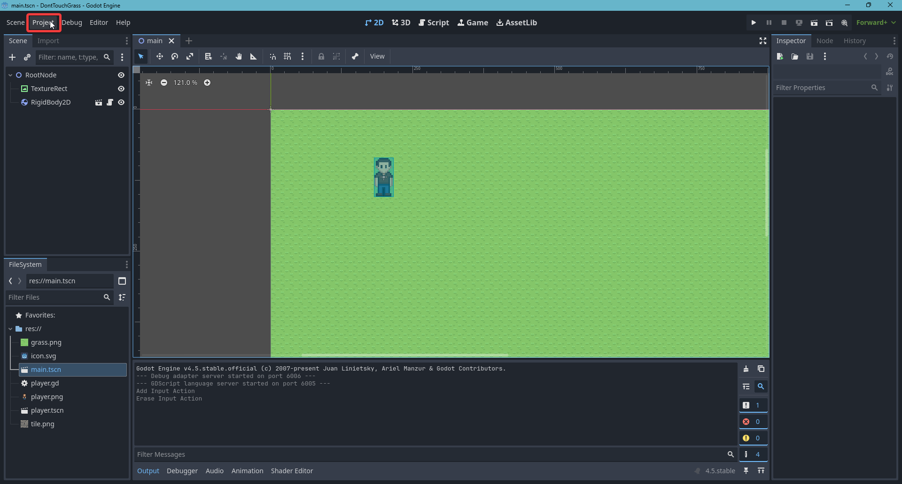
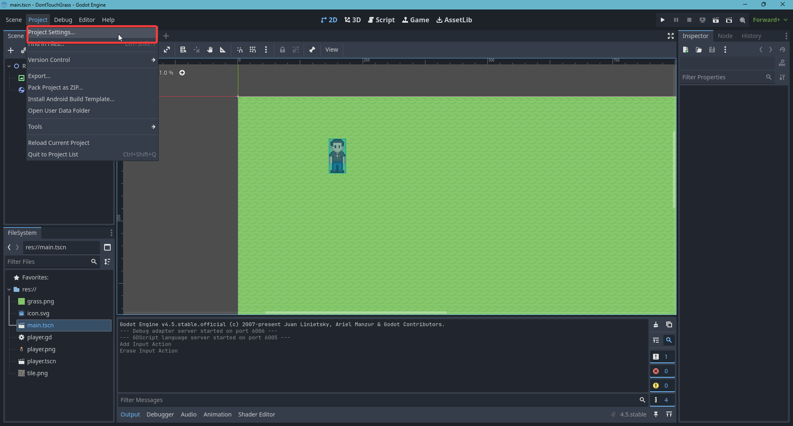
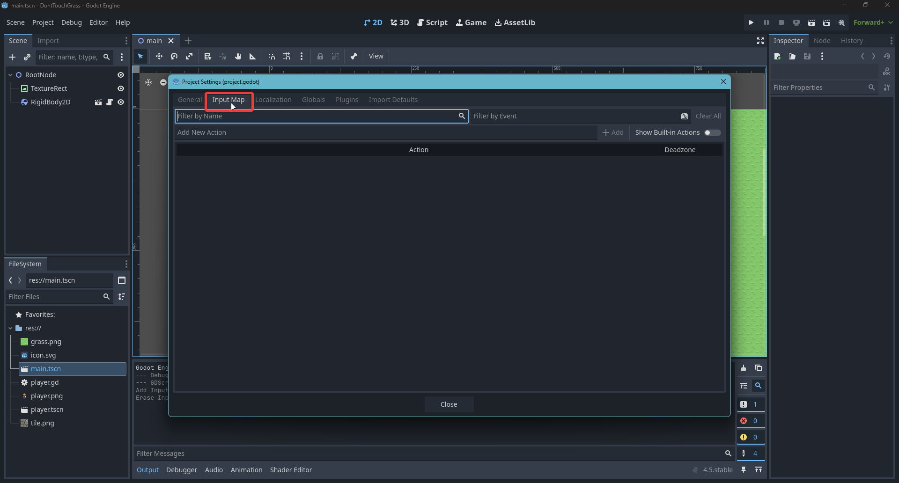
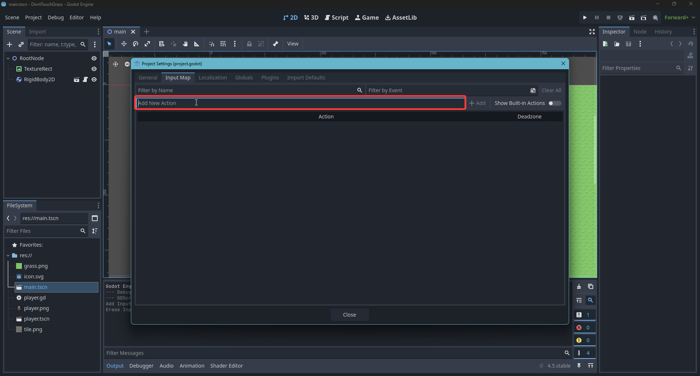
Στο πεδίο γράφουμε το όνομα του νέου **action** και μετά πατάμε το *Add*
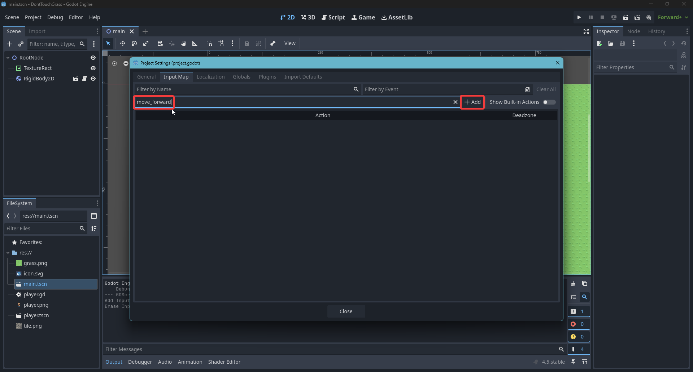
Φτιάξτε και τα υπόλοιπα: move_back, move_right, move_left
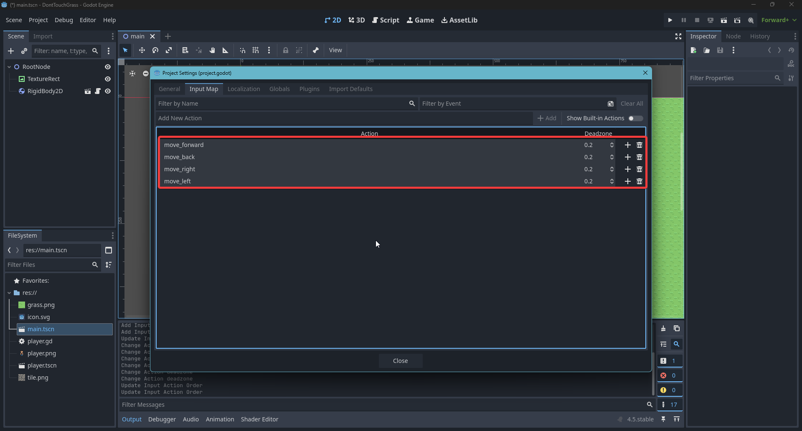
Τώρα μπορούμε να αντιστοιχήσουμε σε κάθε **action** το input απο την συσκευή που θέλουμε. Ας το κάνουμε αρχικα για το **action** *move_forward* και να του αντιστοιχήσουμε το κουμπί *W* του πληκτρολογίου
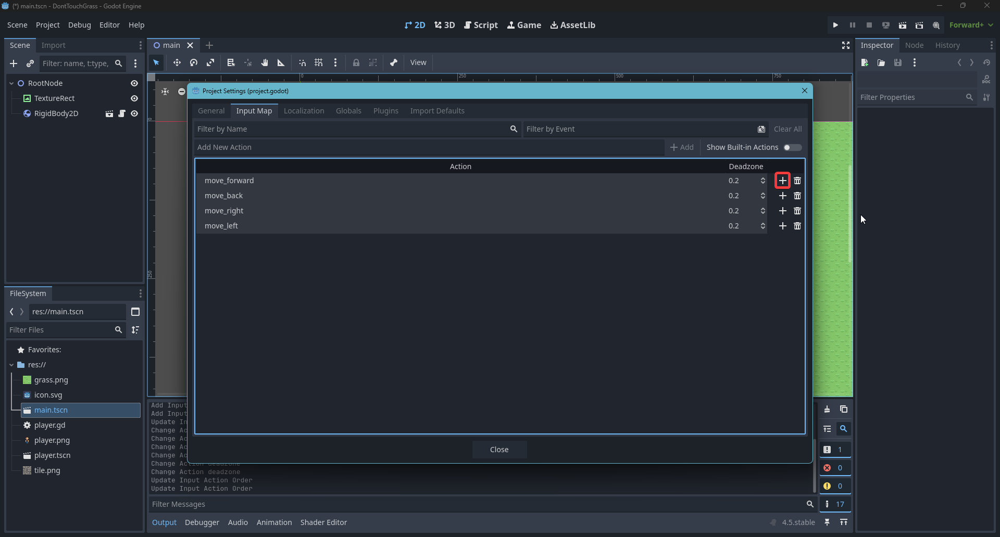
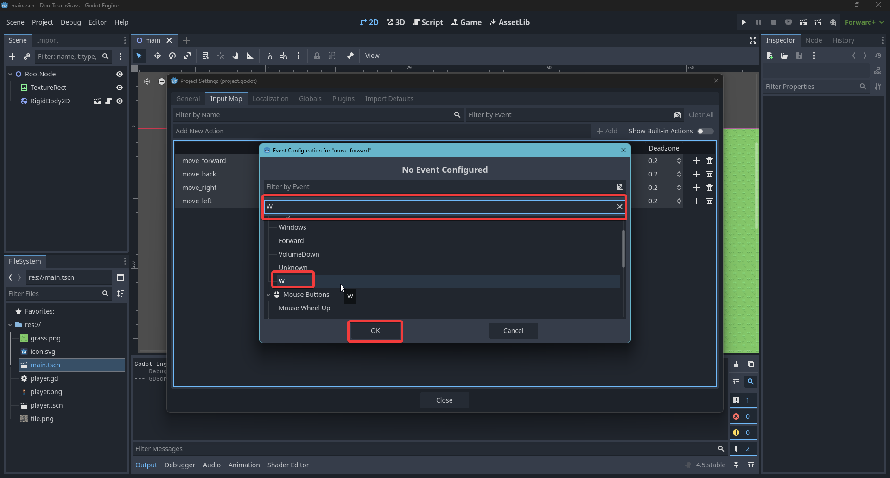
Κάντε το ίδιο και για τα άλλα:
- move_forward = W
- move_left = A
- move_back = S
- move_right = D

## Player Movement
Τώρα που φτιάξαμε τα **input actions** μας μπορούμε να κάνουμε τον παίχτη να κουνηθεί. Οπότε πάμε στο script που του είχαμε κάνει attach στο προηγούμενο κεφάλαιο.
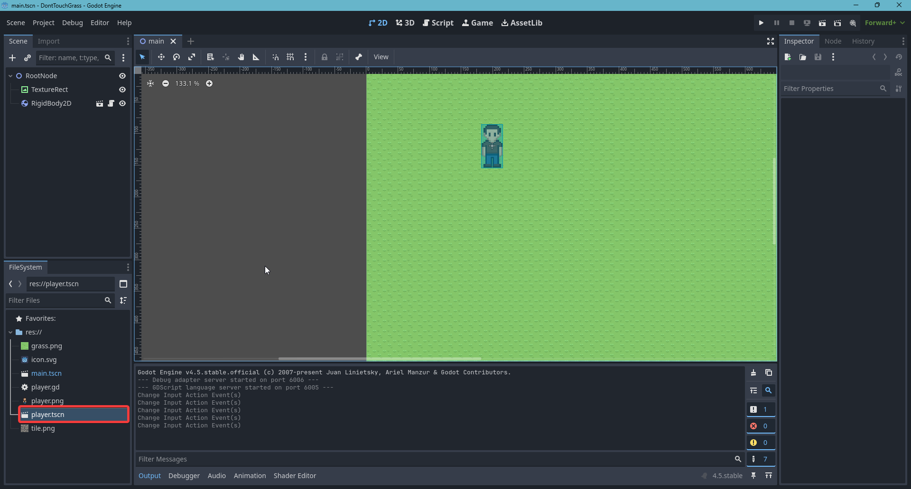
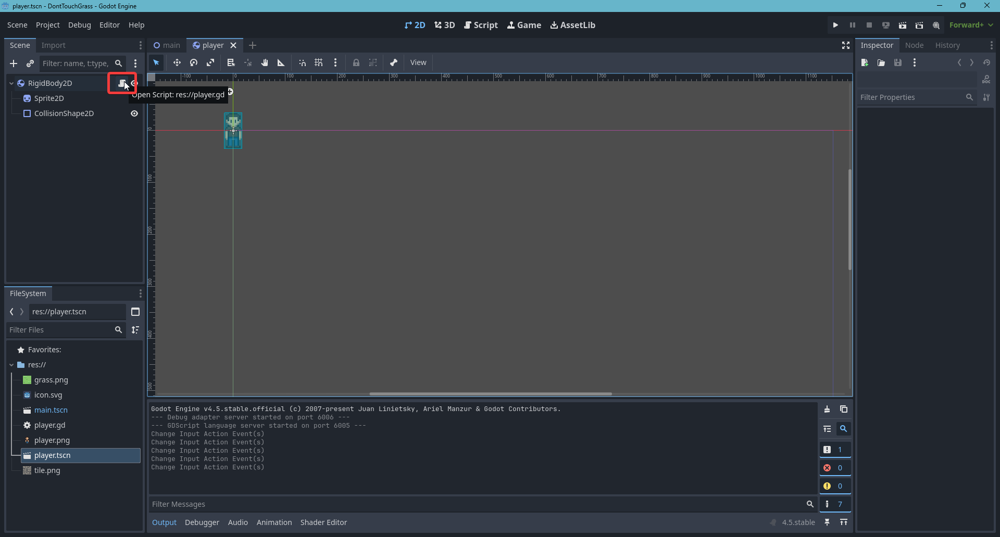

Αυτο που θα κάνουμε ουσιαστικά είναι να ασκήσουμε μια δύναμη στο **RigidBody2D** του παίχτη. Γενικά είναι καλή πρακτική να καλούμε functions και να αλλάζουμε ιδιότητες σε αντικείμενα που ανήκουν στην φυσική μας προσομοίωση σε functions όπως το ```_physics_process()``` και ```_integrate_forces()```. Εδώ ας το κάνουμε στο ```_physics_process()```

```python
func _physics_process(delta : float) -> void:
    pass
```

Αρχικά χρειαζόμαστε κάπως να έχουμε πρόσβαση στα **input actions** που φτιάξαμε. Τα **input actions** αυτά θα παίρνουν τιμές στο διάστημα $[0,1]$. Υπάρχει μια function, η ```Input.get_vector()``` που παιρνόντας της μέσα τα ονόματα των 4 **input actions** μας θα μας επιστρέψει ένα μοναδιαίο διάνυσμα με βάση αυτά

```python
var input_direction : Vector2 = Input.get_vector("move_left",
    "move_right", "move_forward", "move_back")
```

Ας απαντήσουμε κάποιες πιθανές ερωτήσεις.
- Τι είναι διάνυσμα? Ένα διάνυσμα ορίζεται σε κάποια διάσταση. Στην συγκεκριμένη περίπτωση είμαστε στο 2D επίπεδο οπότε το διάνυσμα θα ανήκει στο $\mathbb{R}^2$. To $\mathbb{R}^2$ είναι απλα το $R \times R$ οπου είναι ένα σύνολο που αποτελείται απο $(x,y)\forall x,y\in \mathbb{R}$. Μερικά παραδείγματα 2D διανυσμάτων είναι $(2,3),(-1,3),(3,-5.3)$. Τα διανύσματα χρησιμοποιούνται για να δηλώσουμε θέση ή κατεύθυνση. Στην δικιά μας περίπτωση θέλουμε το **input** μας να δηλώνει την κατεύθυνση που θέλουμε να κουνηθεί ο παίχτης μας.
- Τι είναι μοναδιαίο διάνυσμα? Ενα μοναδιαίο διάνυσμα είναι ένα διάνυσμα που έχει μέτρο ίσο με 1. Είναι κατάλληλο οταν θέλουμε να αναπαραστήσουμε κατεύθυνση, γιατί στις κατευθύνσεις δεν έχει νόημα το μέγεθος. Τα διανύσματα (1,1) και (2,2) δείχνουν στην ίδια κατεύθυνση. Όμως πολλές φορές το (2,2) θα χάλαγε αρκετούς υπολογισμούς.

Τώρα που έχουμε την κατεύθυνση του παίχτη το μόνο που μένει να κάνουμε είναι να ασκήσουμε μια δύναμη προς αυτην την κατεύθυνση. Επίσης θα πολλαπλασιάσουμε το διάνυσμα κατεύθυνσης με μια σταθερα (πχ 100) η οποία θα μεταβάλει το μέγεθος της δύναμης και συνεπώς της ταχύτητας του παίχτη.

```python
func _physics_process(delta: float) -> void:
    var input_direction : Vector2 = Input.get_vector("move_left", "move_right",
    "move_forward", "move_back")
    apply_force(input_direction * 100)
```

Αυτην την στιγμή μπορούμε να κουνήσουμε τον παίχτη μας! Παρόλλα αυτά υπάρχουν κάποια προβλήματα. Αρχικά επειδή του ασκούμε δύναμη αρχίζει επίσης και περιστρέφεται. Κατι που δεν θέλουμε. Οπότε ας περιορίσουμε το **RigidBody2D** να μην μπορει να περιστραφεί.
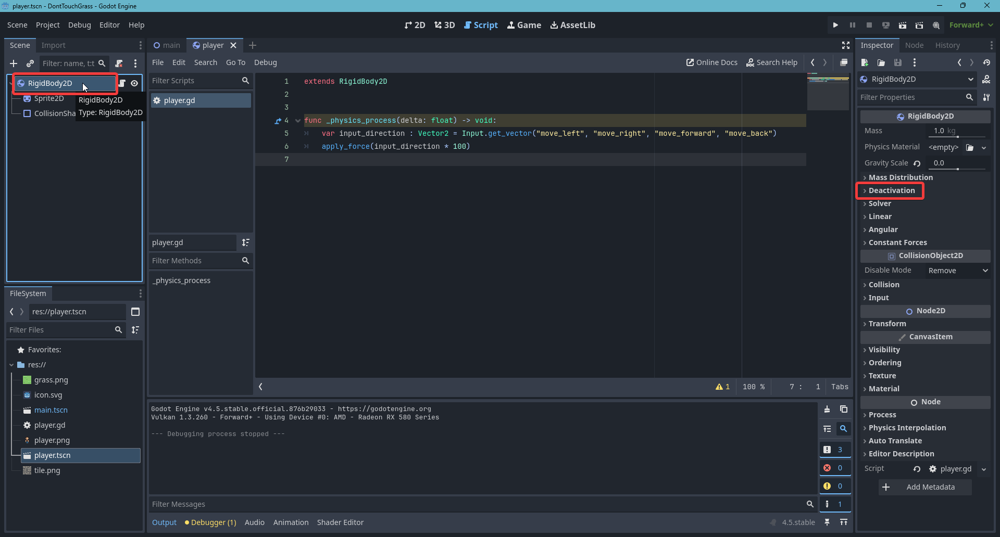
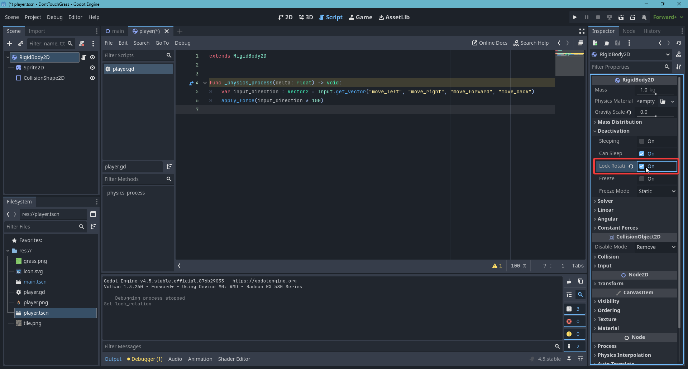

Άλλο ένα πρόβλημα είναι οτι επειδή ασκούμε μια δύναμη στον παίχτη, παίρνει ένα χρονικό διάστημα να αλλάξουμε κατεύθυνση. Δηλαδή αμα κουνιόμαστε προς τα αριστέρα και πατήσουμε να κουνηθούμε προς τα δεξιά παίρνει κάποια ώρα να άλλαξουμε την διανυσματική μας ταχύτητα. Αυτό μπορούμε να το καταπολεμήσουμε αυξάνοντας την απόσβεση (damping). Όσο πιο ψηλά το damping τόσο πιο γρήγορα το σώμα μας θα τείνει προς μηδενική ταχύτητα. Ας το βάλουμε μια τιμή 3 και ας αυξήσουμε επίσης την ταχύτητα στο κώδικα σε 300

```python
func _physics_process(delta: float) -> void:
    var input_direction : Vector2 = Input.get_vector("move_left", "move_right",
    "move_forward", "move_back")
    apply_force(input_direction * 300)
```
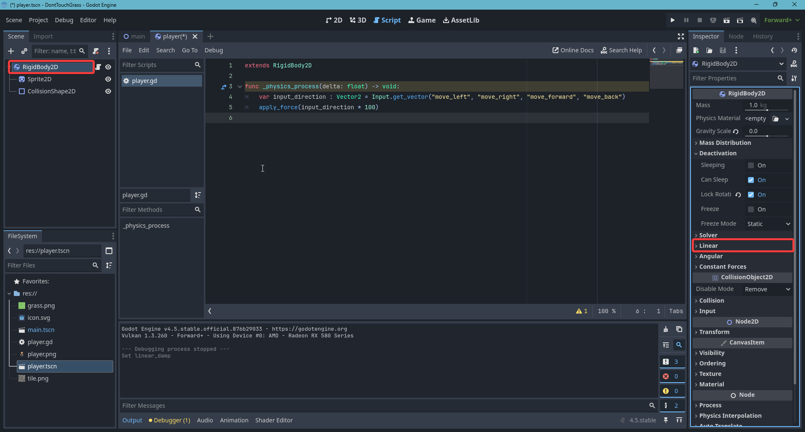
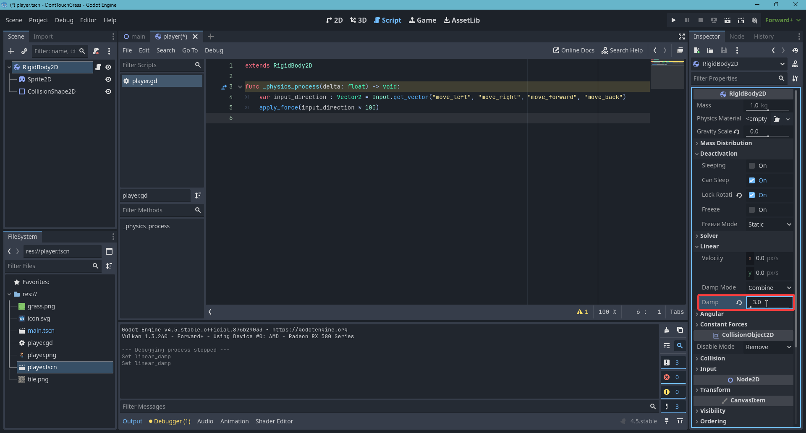

Τώρα είναι κάπως καλύτερα. Γενικά αυτός δεν είναι ο κατάλληλος τρόπος για να κουνάμε χαρακτήρες. Τον χρησιμοποιούμε προς το παρόν γιατί είναι ο πιο εύκολος και γρήγορος.