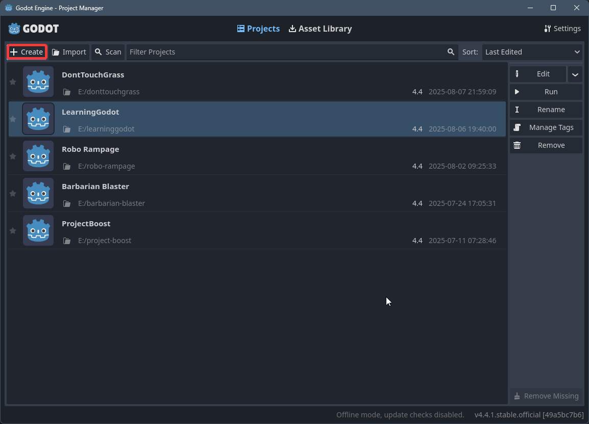

# 1.1 Λήψη Godot

## Λήψη Godot

[Κατέβασε το Godot εδώ](https://godotengine.org/)

Κατέβασε την έκδοση για το λειτουργικό σου σύστημα

Κάνε extract το zip και άνοιξε αυτό χωρίς το console

## Godot Project Manager
Εδώ μπορούμε να διαχειριζόμαστε τα projects μας

Εδώ είναι τα project μας

Πατάμε το *Create* κουμπί για να φτιάξουμε νέο project

1. Το όνομα του project
2. Η θέση στους δίσκους μας
3. Ο τύπος renderer (Forward+ για PC)
4. Το *Create* κουμπί για να φτιάξουμε το project